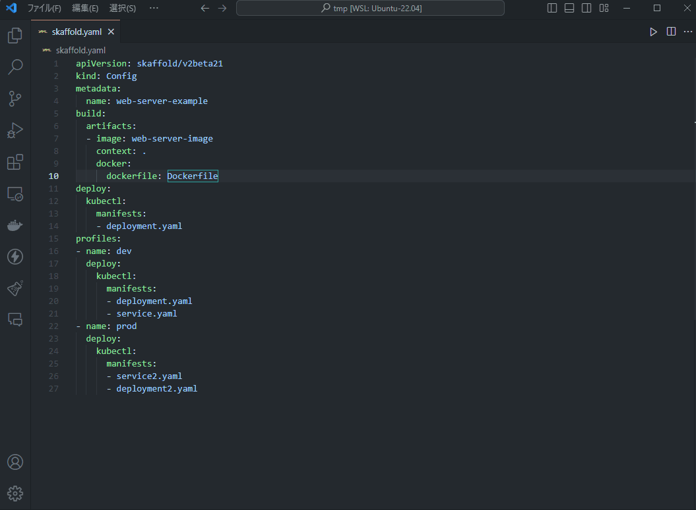

# Skaffold Preview VS Code Extension

  

    <b>Japanese</b>
  

Skaffold Render VS Code 拡張機能は、Visual Studio Code内でSkaffoldマニフェストを直接レンダリングし、Kubernetesを使用している開発者がエディタを離れることなくマニフェストを生成し、プレビューする効率的な方法を提供する強力なツールです。

## 特徴

- 直感的なマニフェストレンダリング: 現在開いているSkaffold YAMLファイルから直接マニフェストをレンダリングし、専用のパネルで結果をプレビューします。
- ステータスバーショートカット: VS Codeのステータスバーに便利なボタンが表示され、Skaffoldレンダーコマンドの実行が簡単になります。このボタンはYAMLファイルが開いているときのみ表示されます。
- エラー処理とメッセージング: レンダリングプロセス中に発生したエラーは明確に伝えられ、トラブルシューティングを容易にします。

## 使用方法

### 1. 拡張機能をインストール:

Visual Studio Code 拡張機能マーケットプレイスで「skaffold-preview」と検索し、インストールします。

### 2. Skaffold YAMLファイルを開く

レンダリングしたいSkaffold YAMLファイルをエディタで開きます。

### 3. レンダリングを実行

コマンドパレット（Ctrl+Shift+P）から「Skaffold Preview」コマンドを実行します。

### 4. 結果をプレビュー

レンダリングが成功すると、生成されたマニフェストの内容が新しいエディタタブでプレビューされます。

## 前提条件

この拡張機能を使用するには、以下がインストールされている必要があります：

- Skaffold CLI

## インストール

Visual Studio Codeの拡張機能ビューを開き、「skaffold-preview」を検索してインストールします。

## 設定

この拡張機能はそのまま使用でき、追加の設定は必要ありません。

## サポート

何か問題が発生した場合や機能リクエストがある場合は、GitHubリポジトリページにIssueを作成してください。

https://github.com/maaaashi/skaffold-preview

  

    <b>English</b>
  

The Skaffold Render VS Code Extension is a powerful tool designed to render Skaffold manifests directly within Visual Studio Code, offering developers working with Kubernetes an efficient way to generate and preview manifests without leaving the editor.

## Features

- Intuitive Manifest Rendering: Directly render manifests from the currently open Skaffold YAML file and preview the results in a dedicated panel.
- Status Bar Shortcut: A convenient button in the VS Code status bar allows for easy execution of the Skaffold render command. This button is displayed only when a YAML file is open.
- Error Handling and Messaging: Errors encountered during the rendering process are clearly communicated, facilitating troubleshooting.

## Usage

### 1. Install the Extension

Search for "skaffold-preview" in the Visual Studio Code Extensions Marketplace and install it.

### 2. Open a Skaffold YAML File

Open the Skaffold YAML file you wish to render in the editor.

### 3. Execute Rendering

execute the "Skaffold Preview" command from the Command Palette (Ctrl+Shift+P).

### 4. Preview Results

Upon successful rendering, the generated manifest content is previewed in a new editor tab.

## Prerequisites

To use this extension, the following must be installed:

- Skaffold CLI

## Installation

Open the Extensions view in Visual Studio Code and search for "skaffold-preview" to install.

## Configuration

This extension works out of the box and does not require additional configuration.

## Support

If you encounter any issues or have feature requests, please create an Issue on the GitHub repository page.

https://github.com/maaaashi/skaffold-preview

